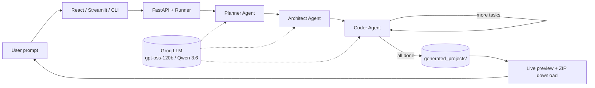

# CodeBuilder — Multi-Agent Coding Assistant

An AI coding assistant that turns a **natural language prompt** into a **working multi-file software project** using a small engineering team of agents: **Planner → Architect → Coder**.

**CodeBuilder** (also referred to as Code Buddy in earlier drafts) is inspired by [codebasics/coder-buddy](https://github.com/codebasics/coder-buddy.git), extended with React + Streamlit UIs, Groq model selection, live preview, and zip download.

---

## 1. What you built

**CodeBuilder** is a full-stack multi-agent coding assistant:

- User describes an app in plain English (e.g. “Build a calculator web app…”)
- **Planner Agent** creates a structured project plan (name, tech stack, features, files)
- **Architect Agent** breaks the plan into ordered per-file engineering tasks
- **Coder Agent** implements each task with tools (`read_file`, `write_file`, `list_files`) and loops until every file is written
- User can **preview code**, **test HTML apps live in the browser**, and **download a ZIP** with proper folder structure

### Product surfaces

| Interface | What it does |
| --- | --- |
| **React + FastAPI** | Primary web UI — generate, live status, live preview iframe, zip download |
| **Streamlit** | Python UI — generate, preview, live iframe (via API), zip download |
| **CLI** | `python main.py` for terminal-based generation |

### Example outputs

- To-do list (HTML / CSS / JS)
- Calculator web app
- Blog API (FastAPI + SQLite)

Generated projects land in:

```text
generated_projects/<slug>_<timestamp>_<id>/
```

---

## 2. Architecture diagram



### Agent roles

| Agent | Responsibility |
| --- | --- |
| **Planner** | Analyzes the request → structured `Plan` (files, features, stack) |
| **Architect** | Turns the plan into ordered `ImplementationTask`s |
| **Coder** | ReAct tool-using agent; writes full file contents; loops per task |

### High-level stack

- **Agents:** LangGraph + LangChain  
- **LLM:** Groq Cloud (`openai/gpt-oss-120b`, `qwen/qwen3.6-27b`, `openai/gpt-oss-20b`)  
- **Backend:** FastAPI  
- **Frontends:** React (Vite) + Streamlit  

For *why* these choices were made, see [DECISIONS.md](./DECISIONS.md).

---

## 3. Results with actual numbers

| Metric | Value | Notes |
| --- | --- | --- |
| **Automated tests** | **11 passed** | Unit + API smoke tests (`pytest -q`) |
| **Agent pipeline stages** | **3** (+ coder loop) | Planner → Architect → Coder |
| **Selectable Groq models** | **3** | Default: `openai/gpt-oss-120b` |
| **UI surfaces** | **3** | React, Streamlit, CLI |
| **Typical todo/calculator files** | **3–5 files** | e.g. `index.html`, `style.css`, `script.js`, `README.md` |
| **Est. cost / small web app** | **~$0.01–$0.05** | On GPT-OSS 120B (paid rates); free-tier may be $0 billed |
| **Est. tokens / small web app** | **~40k–120k** | Depends on file count + tool retries |
| **Live preview** | **Supported** | HTML apps via `/api/projects/.../live/` iframe |
| **Zip download** | **Supported** | Preserves folder structure |

> Numbers for cost/tokens are measured estimates for a small HTML/CSS/JS app. Re-run generation and check [Groq console usage](https://console.groq.com) for your exact bill.

---

## 4. Decisions — why these choices?

See **[DECISIONS.md](./DECISIONS.md)** for:

- 2–3 core technical choices  
- Reason for each  
- Trade-offs considered  

---

## Prerequisites

- Python 3.11+
- Node.js 18+ (React UI)
- Free [Groq API key](https://console.groq.com/keys)

## Setup

```bash
# from repo root
python -m venv .venv

# Windows PowerShell
.\.venv\Scripts\Activate.ps1

# macOS / Linux
# source .venv/bin/activate

pip install -r requirements.txt
copy .env.example .env   # Windows
# cp .env.example .env   # macOS / Linux
```

Edit `.env`:

```env
GROQ_API_KEY=your_real_key
GROQ_DEFAULT_MODEL=openai/gpt-oss-120b
```

```bash
cd frontend
npm install
cd ..
```

## Run

### React + API (recommended)

**Terminal 1 — backend**

```bash
.\.venv\Scripts\Activate.ps1
uvicorn api.server:app --reload --host 0.0.0.0 --port 8000
```

**Terminal 2 — frontend**

```bash
cd frontend
npm run dev
```

Open http://localhost:5173

### Streamlit

```bash
streamlit run app/streamlit_app.py
```

(For live preview in Streamlit, keep the API running on port 8000.)

### CLI

```bash
python main.py --prompt "Build a calculator web app with add, subtract, multiply and divide"
```

## Example prompts

- Build a calculator web app with add, subtract, multiply and divide buttons.
- Create a to-do list application using HTML, CSS, and JavaScript.
- Create a simple blog API in FastAPI with a SQLite database.

## Tests

```bash
pytest -q
```

## Project layout

```text
agent/               # LangGraph agents, prompts, tools, runner
api/                 # FastAPI backend (generate, live preview, zip)
app/                 # Streamlit UI
frontend/            # React (Vite) UI
generated_projects/  # isolated outputs (gitignored)
DECISIONS.md         # engineering choices & trade-offs
main.py              # CLI
```

## Configuration

All runtime values come from environment variables (see `.env.example`):

| Variable | Purpose |
| --- | --- |
| `GROQ_API_KEY` | Groq Cloud API key |
| `GROQ_DEFAULT_MODEL` | Default model id |
| `GENERATED_PROJECTS_DIR` | Output root for generated apps |
| `API_HOST` / `API_PORT` | FastAPI bind settings |
| `CORS_ORIGINS` | Allowed React origins |
| `AGENT_RECURSION_LIMIT` | LangGraph recursion safety limit |
| `LLM_TEMPERATURE` | Sampling temperature |

## License note

Architecture inspired by Codebasics Coder Buddy. This workspace implementation is an independent student/project build with added UI, live preview, and packaging features.
